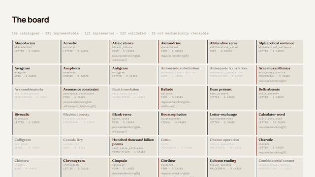

# denckring

[](https://www.python.org/downloads/)
[](#licence)
[](https://docs.astral.sh/ruff/)

A library of experimental writing procedures — lipograms, snowballs, acrostics and
a hundred and fifty more — where **the validator is the eval**.

```python
from denckring import check

report = check("lipogram", "A small conforming bit of writing", forbidden="z")
print(report.satisfied, report.score)
```

```console
$ denckring check snowball poem.txt
$ denckring check lipogram --lang de gedicht.txt
$ denckring status
156 catalogued · 131 implementable · 122 implemented · 122 validated · 25 not mechanically checkable
0 instruments catalogued
```



*The board, nine machines on the stage, and `gemma4` running on the same laptop calling
`check_text` and `apply_procedure` through this package's own MCP server. Nothing in it
is staged — the verdicts are the library's own.*

Every procedure pairs a generator with a validator, and the acceptance criterion is
intrinsic: a lipogram either contains the forbidden letter or it does not. Nothing has
to be invented to test it. `check` is mandatory for every procedure; `apply` is optional
and only meaningful for the constructive ones.

## Install

```console
pip install denckring          # English, German and French, no data files
pip install denckring[en]      # + a pronouncing dictionary, a noun lexicon and a graded word list
pip install denckring[de]      # + a word lexicon and a noun list
pip install denckring[de-wiktionary]   # + German pronunciations, stress and glosses
pip install denckring[fr]      # + a word list, nouns, frequency bands, glosses, syllables and phonemes
```

The extras improve or unlock procedures rather than changing the language itself.
Without `[en]`, syllables are estimated from spelling and every report says how many
words were guessed; with it, that number goes to zero for words the dictionary knows,
and `apply anagram` runs at all — its search needs a word list graded by commonness, not
just one that answers whether a string is a word (ADR 0028). Without `[de]` or `[fr]`,
`charade`, `semordnilap`, `word_square`, `n_plus_7` and `s_plus_7` raise
`MissingCapability` for those languages; with them, they run. `lexicon.graded_words` is
English and French: SCOWL's bands for one, Lexique's corpus frequencies bucketed into six
for the other. The German lexicon is Wikidata Lexemes, which is flat.

`[de-wiktionary]` adds a fourth distribution carrying German pronunciations, stress and
glosses from German Wiktionary, and with it **every implemented row runs in German**.
It is a separate extra because its data is CC BY-SA where `[de]`'s is CC0, and ADR 0013
quarantines a data licence in its own distribution. ADR 0030 records the measurement
behind it: 94.0% token coverage over 341,000 tokens of Wieland, Goethe, Kafka and Mann.

German ships in core because the procedures that need no lexicon work for it
unchanged, and it is a built-in default exactly like English (ADR 0022):
`denckring[de]` overrides that default the same way `denckring[en]` overrides
English's, rather than registering through a separate path.

French ships in core for the same reason, and on core alone 70 of the 122 implemented
rows run in it. `[fr]` is a fifth distribution adding a word list, an ordered noun list,
frequency bands, glosses, a syllable/phoneme table and an aspirated-*h* list, from
Lexique 3.82 and French Wiktionary — both CC BY-SA, so unlike German they need no
separate extra between them. It takes French to **103**. ADR 0032 records why Wikidata
Lexemes, which supplies German, could not supply French: 12,768 French noun lexemes
against 188,948 German ones. ADR 0034 records the line-level syllable seam French needs
and English and German do not — a final mute *e* elides or counts depending on what
follows it, so French cannot be counted word by word — and the mute-e and diérèse rules
built on top of it; the French line count is always `estimated`, never exact.

The other **18** rows raise `MissingCapability` naming what the pack lacks — always
`stress` for French — rather than `UnknownLanguage` naming the language, which is what
asking for French used to get (ADR 0029). **None of those 18 will close.** They are
accentual metres, French has no lexical stress, and they are not French forms; declaring
the capability to reach a bigger number would be a promise the data cannot keep.

## What's here

A hundred and twenty-two of the 156 catalogued procedures are implemented, and
every one of them is validated. Of the rest, 25 have no mechanical acceptance criterion and
are catalogued rather than implemented — see
[What can be checked](#what-can-be-checked) — and the remaining 9 are sourced and
awaiting implementation. `denckring list`
shows what this install can run; `denckring list --status catalogued` shows
everything.

## What can be checked

Not every procedure in the catalogue can be graded by a program, and the catalogue says
which. `checkability: self` means decidable from the text alone; `source` means it needs
the text it was made from, supplied as `--source`; `none` means no computable acceptance
criterion exists — `canada_dry` is *defined* as having no operative constraint, and a
calligram's shape is not something code judges. Those rows are catalogued because the
forms belong in an honest survey, and `denckring status` counts them separately rather
than reporting a gap that can never close.

## Reports

`check` returns a `Report`: `satisfied`, a continuous `score` in `[0, 1]`, a list of
`violations` with character offsets, and free-form `metrics`. The score is monotone in
violation count and `satisfied` is exactly `score == 1.0`, so a caller driving a retry
loop can tell whether a text missed by one word or by fifty.

## Productions

`produce` returns a `Production`, the counterpart on the generating half: the procedure's
id, its `texts` — best first, never empty — `truncated`, saying whether more were found
than `max_results` let through or the search abandoned its own budget, and free-form
`metrics`. `apply` is defined as `produce(...).texts[0]`, the one-text surface for a
caller who wants the best answer and not the search behind it. Both are exported from the
package, so generating no longer means reaching through the registry for it.

`texts` is derived from `candidates`, which is where a generator that ranks says why:
`produce("anagram", "dormitory")` returns `dirty room` first, carrying the SCOWL size band
of its least common word, ahead of covers built from rarer ones (ADR 0027). A caller
reading `texts` gets the order without the reasons, which is a real cost of keeping that
field; the reasons are there for anyone who asks for `candidates` by name.

## Languages

Language packs declare capabilities; procedures declare what they require. Asking for a
language whose pack is not installed, or a procedure whose requirements that pack does
not meet, raises rather than quietly returning an approximate answer.

`describe` answers both halves of "can I run this in French": `languages` is the row's
authored editorial scope — `wechselsatz` is German by nature, not merely by capability —
and `runs_in` is computed from the installed packs, so it says what *this* install can
actually check the row in. `belle_absente` is `languages: [en]` and `runs_in` all three.

Whether `ä` counts as `a` is an editorial decision rather than a library constant, so it
is a parameter: `fold_diacritics` defaults to true and can be turned off per call. Glyph
questions never fold — *Masse* satisfies the prisoner's constraint and *Maße* does not,
because a written `ß` carries an ascender.

## What is stable

`0.x` means the API can change in a minor release, and the changelog says when it does.
Five surfaces are treated as contracts regardless, because things outside this repository
are built on them:

- **Procedure ids.** An id that has shipped does not change meaning. When a row is
  replaced, the old id stays findable through `denckring search` as an alias — though
  `get` resolves ids only, and raises `UnknownProcedure` naming the replacement.
  `multiple_constraint`, which replaced `univocalic_lipogram_pair`, is the precedent.
- **`Report` as JSON** — `procedure`, `satisfied`, `score`, `violations`, `metrics` — and
  the `--json` output of `check`, `show` and `describe` that carries it. Fields may be
  added; the ones already there do not change type or meaning. `describe`'s
  `Description` carries `runs_in` under the same promise. Its value is computed from the
  installed packs rather than read off the catalogue, which several of its neighbours
  already are; they are not listed here, because a list of them is a thing that goes
  stale the next time a computed field is added.
- **`Production` as JSON** — `procedure`, `candidates`, `texts`, `truncated`, `metrics`
  — and the `--json` output of `apply` that carries it. It is `Report`'s counterpart on
  the generating half and is covered by the same promise, in the same words: fields may
  be added; the ones already there do not change type or meaning. Both `candidates` and
  `texts` are ordered, best first, because `apply` returns `texts[0]`; `texts` is the
  candidates' texts alone, and a candidate additionally carries the `metrics` it was
  ranked by.
- **The catalogue export schema** (`denckring catalogue export`), including the `licence`
  and `attribution` keys the CC BY terms are carried by.
- **The `denckring.lang` entry-point group** and the capability names a pack declares, so
  an installed third-party pack keeps working.

Not stable, and expected to move: violation `rule` strings, `metrics` keys, message
wording, and everything under `denckring.core`. A check's *verdict* is a contract; the
reason it gives for a failure is not one yet.

## Three ways in

```python
from denckring import get, produce

get("lipogram").check(text, lang="en")  # 1. library, the checking half
produce("cut_up", text, seed=7).texts  # ...and the generating half
```

```console
denckring check lipogram --json text.txt          # 2. CLI, exits 1 when unsatisfied
denckring apply cut_up --json text.txt            #    generating, emitting a Production
denckring show lipogram --json                    # 3. stable JSON for non-Python callers
```

## Letting a model use it

A model writing under a constraint can check its own draft instead of guessing,
which is the difference between a haiku it believes is a haiku and one that is.
Two entry points, both over the same core functions, so they cannot disagree
about what a procedure is:

```console
pip install denckring[mcp]    # an MCP server: denckring-mcp
```

The server exposes four tools — `list_procedures`, `describe_procedure`,
`check_text`, `apply_procedure` — with the procedure as a parameter rather than
eighty-six tools, because model performance degrades with tool count. Errors
come back as data (`{"code": "invalid_params", ...}`), never as a traceback a
model cannot act on.

For Claude Code, the skill at
[`skills/denckring/SKILL.md`](https://github.com/senzelden/denckring/blob/main/skills/denckring/SKILL.md)
shells out to the CLI instead, and needs no extra beyond the package itself.

## Documentation

The [gallery](https://senzelden.github.io/denckring/gallery/) has a page per catalogued
procedure, generated from the catalogue and the golden fixtures — so every worked
example on it is one the test suite enforces, and none of it can drift. Build it
locally with:

```console
uv run python scripts/build_gallery.py && uv run mkdocs serve
```

## Where the data lives

Three kinds of thing a procedure can need, and they are handled differently. A **device**
— Harsdörffer's five rings — is the procedure, so it ships with it. A **language pack**
describes a language and ships separately when it carries weight: `denckring[en]` adds a
pronouncing dictionary, a noun lexicon and SCOWL's commonness-graded word list,
`denckring[de]` adds a word lexicon and a noun list, and `denckring[fr]` adds a word
list, nouns, frequency bands, glosses and a syllable/phoneme table with the line-level
elision rules built on it (ADR 0034). Each vendored source keeps its own
licence file beside the data it covers, which is why installing `[en]` for syllable
counts also brings a word list down with it (ADR 0028). A **corpus** is somebody's
collection, so the package carries the loader and you supply the reading:

```console
denckring check ideenwuerfeln throw.txt --source my-excerpts.json
```

### Bringing your own device

A device — the Denckring's rings, Llull's figure or the Poesie-Automat's board — ships
with its own word-lists, but they do not have to be the only ones. Set
`DENCKRING_DEVICE_PATH` to a colon-separated list of directories, and `denckring.core.
device.load` searches them, in order, before the directory this package ships — so a
directory earlier on the path can add a device under a new id, or shadow a packaged one
under an existing id:

```console
DENCKRING_DEVICE_PATH=/path/to/my/devices denckring check denckring wort.txt --param device=my_rings
```

Each directory holds one YAML file per device, named `<id>.yaml`, in the shape the
packaged devices already use (see `src/denckring/data/devices/`). A directory that does
not exist, or cannot be read, is skipped rather than raised on — a stale entry in the
environment does not stop a packaged device from loading.

What this does not give you: no schema versioning beyond ordinary YAML/Pydantic
validation, no record of where a loaded device actually came from, and if a device on
the path shadows a packaged id, the packaged device is simply not what ran — `load` has
no way to say so, so a caller who needs to know must control what it puts on the path.
The id itself is untrusted input and is validated down to a bare name — no path
separators, no `..`, not absolute — so a cartridge must live *in* a directory on the
path; it cannot be addressed by giving it a path of its own. A relative entry in
`DENCKRING_DEVICE_PATH` resolves against the process's current working directory at
call time, not against wherever the variable was set, so a caller who sets it once and
later changes directory gets silent misses under the same skip-quietly contract as a
directory that never existed.

## The explorer

A local browser for the catalogue and a bench for trying procedures on your own text,
kept outside the distribution in [`apps/explorer`](apps/explorer):

```console
uv run --project apps/explorer explorer
```

It lays the catalogue out as a compositor's type case — one compartment per procedure,
filled where a checker exists — builds each parameter form from that procedure's own
`params_schema()`, and marks the offending characters inline using the offsets every
`Violation` carries.

## Contributing

One module per procedure, `check` mandatory. Start with
`uv run python scripts/new_procedure.py <id>`, which scaffolds the module, test,
strategy, golden fixture and catalogue row. See
[CONTRIBUTING.md](CONTRIBUTING.md).

## Scope of the name

The *Fünffacher Denckring der Teutschen Sprache* (Harsdörffer, 1651) is one device
among the hundred and fifty catalogued here, not the whole subject. Werkzeug is not
only about tools either. Searching for `oulipy` will also find this package.

## Using the name

The name is reserved — Apache-2.0 grants no trade mark rights (section 6), which is what
keeps a fork from publishing as this project. What that reservation permits, stated so it
can be complied with rather than guessed at: redistribute the package unmodified under
the name freely, say that your work uses or is compatible with denckring freely, and
rename before publishing a modified version. "denckring" in the name of a package you
publish, or on a site presenting your fork as the original, is the line.

## The catalogue as data

The catalogue is 156 sourced procedures and is a contribution in its own right — useful
to someone who will never install the package.

```console
denckring search rhopalic            # finds snowball by its alias
denckring list --family form         # the prosodic and stanzaic entries
denckring catalogue export --format json --output catalogue.json
denckring catalogue export --format csv
```

Every entry records **how** its source was established, which is the field that makes
the dataset trustworthy: `primary` names an author, work and year the catalogue stands
behind; `reference` means the form is attested in a standard work — the *Oulipo
Compendium*, Borgmann's *Language on Vacation*, *Word Ways* — rather than traced to an
origin; `traditional` means no single origin exists to name. A `reference` row is not a
weaker `primary`; it is an honest statement that the origin is not established.

Entries are filed under one of eight families — `letter`, `word`, `syntax`, `form`,
`permutation`, `procedural`, `translation`, `visual` — and carry the other names each
form travels under, so a search for `isogram` finds `heterogram`.

Each entry also declares a `layer`. A `verfahren` is accepted the way everything in this
catalogue has always been accepted: run it, get text, have a checker score it. An
`instrument` is a combinatorial device — temurah, the zāʾirja — admitted for a mechanism
that is faithfully formalised and sourced, whether or not anyone would read its output.
Every row is a `verfahren` today, and `denckring status` counts the two on separate lines
so that the headline number keeps meaning what it has always meant (ADR 0033).

## Licence

Code is Apache-2.0 — see [LICENSE](LICENSE) and [NOTICE](NOTICE), which every
derivative distribution has to carry. The catalogue is CC BY 4.0 — see
[LICENSE-DATA](LICENSE-DATA) for the attribution string and what the licence does and
does not cover. The code was MIT before 0.1.0; ADR 0024 records why it moved.
